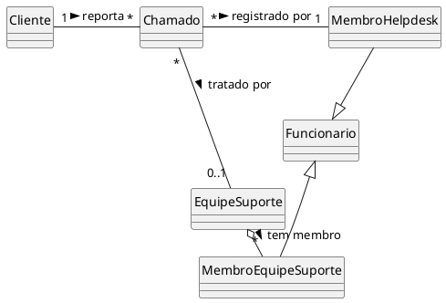
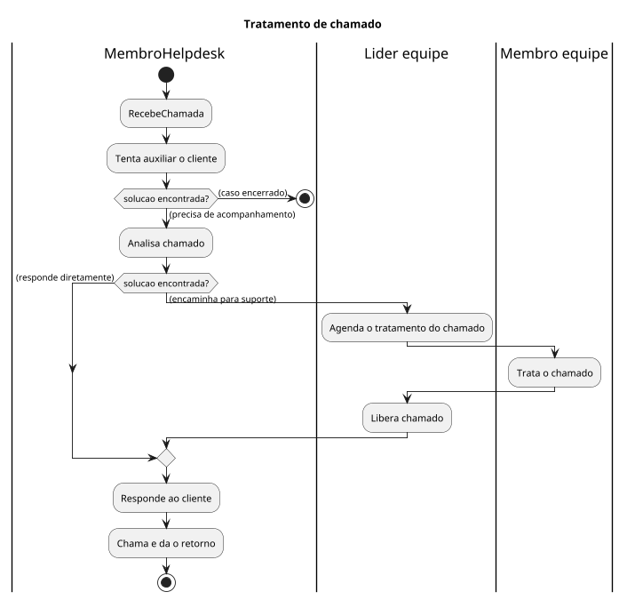
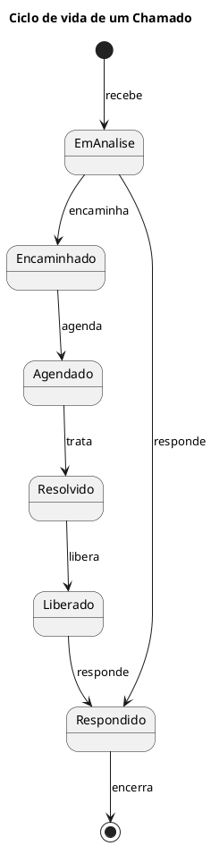

# Análise de Negócios (Espaço do problema)

## Modelo de domínio de negócios

Para a construção do modelo de negócios começamos pela construção do modelo de domínio onde modelamos a estrutura da organização e informação.
Empregados, times e sistemas de informação são objetos ativos (ou Business Workers) e objetos passivos, como documentos, artefatos, produtos são chamados de entidades de negócios.
Representamos estes objetos ativos e entidades de negócios em diagramas de classe de domínio.

---

# Diagrama de classes de domínio

---

# Processos de negócios

Em seguida precisamos entender como um chamado é tratado pelos funcionários da empresa.
Iremos modelar os processos de negócios. Para modelar processos utilizaremos diagramas de atividade.

Em alto nível de abstração podemos modelar o processo iniciando com um evento de recebimento de uma chamada do cliente, o tratamento do chamado reportado e por fim, encerrando com a chamada de retorno ao cliente.

O processo, com os respectivos responsáveis pela execução das atividades foram modelados no diagrama de atividades utilizando raias no diagrama de atividades.

---

# Diagrama de atividades

---

# Ciclo de Vida de Entidades de Interesse

Podemos verificar que o ciclo de vida da entidade de negócio Chamado é bastante complexo.
Vamos modelar seu ciclo de vida utilizando um diagrama de estados.

---

# Ciclo de vida de um Chamado

